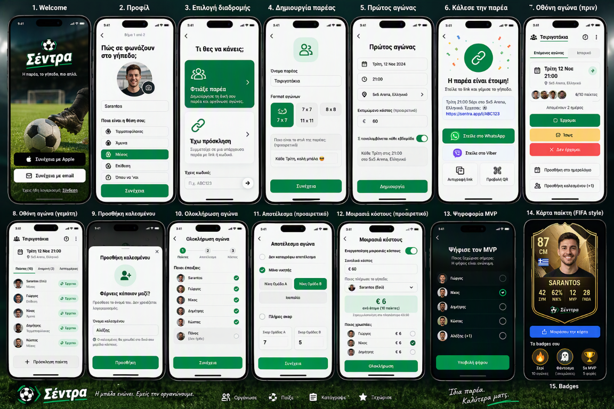

# Sentra Design

Whole-app reference: [mockups/sentra-flow.png](mockups/sentra-flow.png).
Card reference: **Option 1, Θυρεός**, in [mockups/sentra-card-options.png](mockups/sentra-card-options.png).
Updated 2026-10-09. Current boundary: **Step 2, with the authorized card-only redesign**.

## Authority and Scope

The mockup establishes the visual direction for the whole app, not its data model
or business rules. [The written specification](../.github/copilot-instructions.md)
wins whenever fields, flows, permissions, navigation destinations or rules differ.
The [schema mapping](schema-to-swift.md) remains authoritative for wire contracts.

Ignore the image's copy, dates, scores and typos. App-owned text belongs in
[Localizable.xcstrings](../ios/Sentra/Resources/Localizable.xcstrings), in correct
Greek with English translations. Names and other backend values remain verbatim.
Dates come from model timestamps and locale/time-zone-aware formatters, not artwork.

The Step 2 dashboard is a component preview, not an implementation of these
screens. Its hero has no sign-in buttons; its RSVP/MVP selections are local visual
state; progress does not advance a completion workflow. No new route,
authentication flow, database mutation, vote submission or purchase was added.
The October 9 request authorizes only the player-card renderer, local photo editor,
Vision crop preparation, optional device motion and their samples/tests. It
supersedes the earlier card-only geometry and circular-fallback guidance, not the
other components, screen ownership or backend contract. Step 3 remains unstarted.

## Screen-to-Step Mapping

Implement each actual screen only during its assigned, authorized step.

| Screen | Screen | Step |
| --- | --- | --- |
| 1 | Welcome / authentication entry | 3 |
| 2 | Profile | 3 |
| 3 | Organizer / invite choice | 3 |
| 4 | Create group during onboarding | 3 |
| 5 | First match during onboarding | 3 |
| 6 | Invite the group | 3 |
| 7 | Upcoming match and RSVP | 4 |
| 8 | Full match, roster and waitlist | 4 |
| 9 | Add guest | 4 |
| 10 | Finish match / played roster | 5 |
| 11 | Optional result | 5 |
| 12 | Optional cost split | 5 |
| 13 | MVP voting | 5 |
| 14 | Player card | 8 |
| 15 | Badges | 8 |

Screens 1-6 remain Step 3, 7-9 Step 4, 10-13 Step 5, and 14-15 Step 8.
The image does not authorize any of those workflows in Step 2.

### Corrections That Must Survive Implementation

- Screen 11 has **one exclusive result mode**: none, winner only, or full score.
  Only the selected mode's fields are visible. None has no result fields; winner
  only shows A/B/draw; full score shows scores and optional scorer input. The
  database, not a competing client calculation, derives the winner from scores.
- Screen 14 uses **ΤΕΡ / ΑΜΥ / ΜΕΣ / ΕΠΙ**, never CM. The existing ANY value keeps
  its separate localized fallback, ΠΑΝ. Medium/large card stats are
  **ΣΥΜ / ΝΙΚ% / MVP / ΓΚΟΛ / ΣΕΡΙ / ΑΞΙ**; small cards retain the first four.
- Use an **original silhouette, frame and typography**. Weekly MVP keeps the
  dark/gold treatment; ordinary tiers use the materials below. No EA FC/FIFA
  geometry, proprietary font, league/club badge or logo is reproduced.
- Keep written-spec navigation: **Αγώνες, Παρέες, Στατιστικά, Προφίλ**. Do not copy
  the image's alternative bottom labels. Step 2 still uses its placeholder stack.
- Welcome is not a carousel or intro-slide flow. Capacity remains derived from
  format; waitlist remains a database outcome; MVP privacy/eligibility and optional
  result/cost rules remain unchanged.

## Visual Direction

Use restrained, football-focused utility screens: off-white canvas, white list
surfaces, compact bold headings, emerald commands and clear status color coding.
Use dark forest surfaces for MVP and tier-specific materials for player cards.
Photography belongs in the Welcome hero and card portrait; ordinary forms and
lists remain quiet and unframed.

The composite is a raster reference, not a point-accurate design file. Native
dimensions below are normalized iOS points, chosen to preserve its proportions
while meeting Dynamic Type, contrast and minimum-target requirements.

## Palette

Bounded flat-control samples from the saved image were approximately green
`#027E46`, amber `#FBCF73`, red `#F44D4D`, and MVP dark `#011311`. Compression,
lighting and antialiasing produce nearby values. The following values are the
implementation contract in [SentraTheme.swift](../ios/Sentra/Core/Theme/SentraTheme.swift).
In particular, the red action fill is intentionally darker for readable white text.

### General Surfaces and Commands

| Role / token | Light | Dark | Use |
| --- | --- | --- | --- |
| `brand` | `#00864A` | `#00864A` | Primary and yes action fills |
| `darkGreen` | `#00482E` | `#00482E` | Deep brand accent |
| `onBrand` | `#FFFFFF` | `#FFFFFF` | Text/icons on brand and red action fills |
| `primary` | `#007B45` | `#7BDCAE` | Green text, links, selected tabs and yes chips |
| `onPrimary` | `#FFFFFF` | `#08251A` | Contrast companion for adaptive primary surfaces |
| `background` | `#F5F7F5` | `#101A15` | Page canvas and background asset |
| `surface` | `#FFFFFF` | `#1A2720` | List, form and individual match-card surfaces |
| `surfaceMuted` | `#EDF2EE` | `#26382D` | Inactive markers and avatar fallback |
| `ink` | `#17271D` | `#F4F8F5` | Main text |
| `mutedInk` | `#58665D` | `#B6C9BE` | Metadata and secondary text |
| `border` | `#D8E1DA` | `#40564A` | Dividers and quiet outlines |
| `maybeFill` / `onMaybe` | `#FFD16B` / `#473204` | Same | Amber RSVP button with dark text |
| `noFill` | `#D12F46` | `#D12F46` | No RSVP and destructive action fills |

### Status Chips

| Status | Text/icon: light / dark | Background: light / dark |
| --- | --- | --- |
| Yes | `#007B45` / `#7BDCAE` | `#E5F5EB` / `#153D29` |
| Maybe | `#735000` / `#FFD16B` | `#FFF3D6` / `#423519` |
| No | `#B92E43` / `#FFA5B1` | `#FFE8EC` / `#47242C` |
| Waitlist | `#3F5D74` / `#BAD2E4` | `#E6EFF5` / `#273D48` |

Every status has an SF Symbol and localized label; color never carries meaning
alone. The waiting row shows its dense queue position, not the raw ordering ticket.

### MVP and Legacy Card Tokens

| Token | Hex | Use |
| --- | --- | --- |
| `mvpSurface` | `#061B16` | Full-width dark MVP band; hero text backdrop |
| `mvpRaised` | `#0D2B23` | Available raised dark-surface token |
| `onMVP` | `#F4F8F5` | MVP and hero text |
| `mutedMVP` | `#B6CEC1` | MVP position/guest metadata |
| `mvpAccent` | `#79E2AE` | Selected MVP indicator |
| `premiumSurface` | `#111B18` | Retained legacy premium token |
| `onPremium` | `#FCF6E6` | Retained text-on-premium token |
| `bronze` | `#DBB18A` | Retained tier accent |
| `silver` | `#D3E0E5` | Retained tier accent |
| `gold` | `#E5C875` | Retained tier accent |
| `elite` | `#F4DB91` | Retained tier accent |

The shared theme is unchanged by the card-only redesign. The new renderer uses
`CardTierStyle`, not the legacy premium tokens. MVP surfaces remain dark in either
app appearance. Core enabled text pairs are checked at 4.5:1 or better. Hero text
has a full-width, 86%-opaque dark
backdrop whose height follows its text; contrast is also checked over a pure-white
image pixel. The photo below remains unobscured. Disabled-control opacity is not
the normal-text contrast target.

## Type Scale

Use native SF system typography, not the image's unidentified sports font. This
preserves Greek coverage and Dynamic Type. Do not add negative tracking or scale
text with viewport width. Numeric columns use monospaced digits.

| Role | Default size | Weight / treatment | Swift behavior |
| --- | --- | --- | --- |
| Brand wordmark | 34 pt | Heavy, italic | Semantic large title |
| Page / sample title | 22 pt | Bold | Title 2 |
| Section heading | 17 pt | Bold | Headline |
| Body / list name | 17 pt | Regular / semibold | Body |
| Button title | 17 pt | Semibold | Body; wraps vertically |
| Metadata / chip / stat label | 12 pt | Medium | Caption |
| Player-card name | 20 pt | Bold | Title 3; wraps |
| Card OVR | 52 pt | Heavy, straight, monospaced digits | ScaledMetric relative to large title |

Decorative avatar initials and 20-22 pt tool/selection icons stay inside stable
slots. The accessible name/status is supplied separately. Long names, captions and
button text must grow vertically rather than collide with neighbors.

## Spacing, Geometry and Shadows

- Spacing scale: **4, 8, 12, 16, 24, 32, 40 pt**. Use 16 pt screen insets, 12 pt
  row gaps, 24 pt feature/card padding and 32 pt separation between preview samples.
- Command buttons: full available width, **52 pt minimum height**. All interactive
  targets, including icon tools and segments, are at least **44 pt**.
- Controls and ordinary cards: **8 pt radius**. Status chips are capsules; avatars
  are circular. Do not turn entire form sections into floating cards or nest cards.
- Player rows: **60 pt minimum**, 40 pt avatar, 12 pt content gap and 8 pt vertical
  padding. Match-card attendee thumbnails are 28 pt with a small overlap.
- Dividers: 0.5-1 pt; secondary-button outline: 1 pt; selected tab underline: 2 pt.
- Match-card shadow: black at **6%**, blur **10 pt**, vertical offset **4 pt**.
  No large drop shadows around whole page sections.
- Step 2 hero: unframed, full width, **360 pt minimum height**, with text allowed
  to increase its height. It leaves room for the next preview section on a small
  standard-size iPhone. Step 3 will own the real Welcome screen layout.
- The existing dashboard grid keeps its **280 pt preferred minimum column width**
  and one column at accessibility sizes. The renderer now offers small/medium/large
  preferred widths of **240/320/400 pt** and a roughly **2:3** minimum canvas;
  constrained widths and larger text can increase its height rather than clip.
- Card silhouette: original angled shoulders, central top notch and chevron base.
  Double metallic outlines are **1.7 pt** and **0.75 pt**, inset **5 pt**, with a
  fine upper bevel. Shadow: black **16%**, blur **12 pt**, vertical offset **6 pt**.

## Component Rules

### Buttons and RSVP

Primary actions are emerald with white text/icons in both appearances. Secondary
actions use the current surface, main ink and a quiet border. Destructive actions
use the accessible red. Use SF Symbols for tools, with localized accessibility
labels and help for icon-only commands.

Stack the three RSVP requests vertically: green yes, amber maybe, red no. Preserve
an equal-sized trailing selection slot so changing selection cannot move the text.
Use an inset outline and checkmark in addition to color. Waitlist is displayed as
status, not offered as a fourth requested response. The reusable waitlist button
remains disabled if displayed elsewhere.

Pressed feedback changes opacity without changing geometry. Loading disables the
command and preserves the icon slot; Reduce Motion uses a static loading symbol.
No preview control sends an RSVP mutation.

### Match Card, Rows and Chips

The match card is an individual repeated item: group metadata, calendar/date row,
venue, format/status, compact attendee stack, authoritative occupancy and optional
expected cost. The date uses heading size, not hero-size type. Never bake a date
or fixed capacity into the component.

Rows use a circular avatar, semibold verbatim name, position or guest subtitle,
and a trailing status capsule. They stack at accessibility sizes. Dividers and
shared surfaces organize the roster; each row is not its own floating card.
Chips use explicit foreground/background tokens rather than arbitrary tint opacity.

### Segmented Roster Tabs: Screen 8

Use equal-emphasis text segments over a shared surface with a green selected
underline, a neutral hairline baseline, localized counts and selected accessibility
traits. Segments have 44 pt targets. Use a vertical arrangement at accessibility
sizes or when the labels cannot fit; do not compress labels to illegibility.

The Step 2 sample switches between confirmed players, waitlist and other responses
(maybe/no). These are local filters over the same immutable snapshot. Switching
tabs does not alter counts, queue order or responses. Appearance/state sample
selectors retain native segmented controls, changing to menus at accessibility sizes.

### Progress Header: Screen 10

Show three numbered markers with labels for played roster, result and cost.
Markers are 24 pt at the default caption size and scale with that text style.
Current/completed markers are green; completed markers use a checkmark; future
markers are neutral. Connect them with short lines and provide the localized
current/total summary for VoiceOver. Stack the labeled steps vertically when needed.

These are the three editable completion stages; MVP opens after completion under
the written/database rules. The preview demonstrates step one without implementing
the finish workflow or any next/back mutation behavior.

### Dark MVP List: Screen 13

Use an unframed dark forest band, a compact white title, white names, subdued
position/guest labels, subtle dividers and a green selected-circle indicator.
The whole row is the hit target. The preview shows registered examples and a guest
and allows one local selection, including clearing it; it has no submit action.

This sample is not an eligibility calculation or a real voting roster. Actual
Step 5 must use the authorized participant/voting contract, exclude self-votes,
keep ballots private and never query individual votes from the client.

### Original Player Cards: Screen 14

The October 9 **Option 1, Θυρεός** choice governs this component. The reference is
directional, not a traced card, portrait or texture. The four free materials,
weekly MVP and provisional appearance share the same original shape.

Owners are [PlayerCardView.swift](../ios/Sentra/Core/Components/PlayerCard/PlayerCardView.swift),
[SentraCardShape.swift](../ios/Sentra/Core/Components/PlayerCard/SentraCardShape.swift),
[CardTierStyle.swift](../ios/Sentra/Core/Components/PlayerCard/CardTierStyle.swift),
and [CardPortraitView.swift](../ios/Sentra/Core/Components/PlayerCard/CardPortraitView.swift).
[PlayerCardShell.swift](../ios/Sentra/Core/Components/PlayerCardShell.swift) is only
a compatibility delegate, so no existing screen/caller needed an edit.

#### Composition

- Upper-middle shield portrait, **68% of inner content width**, approximately
  58-60% of total card bounds. Its **0.9 width/height** aspect and normalized crop
  remain identical at every size. No circular mask or full-body cutout is used.
- The matching portrait shield has gently rounded transitions, **1.8 pt** outer
  and **0.65 pt** inset borders, a soft inner shadow, edge vignette and fade from
  78% down to its bottom. An original SF Symbols football/laurel crest overlaps
  the top. It is not a club, league or licensed game emblem.
- OVR sits outside the portrait at upper left, with Greek position and optional
  validated two-letter country flag. Position remains visible without OVR.
- Uppercase name, title, labels above bold stat values, up to three badges, a
  group-initials shield with group-colored border, and restrained Σέντρα branding.
  The group initials use tier ink/material so arbitrary group colors cannot make
  the text unreadable. Backend names/badges are display data, not localization keys.
- Small hides the title and the final two stats. Medium/large show all six in one
  row. Accessibility sizes place identity above the photo and use two stat columns.
  Names and state text can wrap; the canvas is not a fixed-height text trap.
- Missing win percentage or reliability uses a short unavailable marker with a
  full VoiceOver description. **ΑΞΙ is not in the deployed stats view**: the
  renderer accepts an optional 0...1 Decimal, but no live source is invented.

#### Materials and Appearance Rules

These card-local colors are independent of app light/dark mode. Thin deterministic
brushed or marble lines and faint chevrons supply texture; no remote material asset
or copied commercial card frame is used.

| Appearance | Gradient: top / middle / bottom | Ink | Metal accent |
| --- | --- | --- | --- |
| Bronze, OVR <65 | `#F8DEC2` / `#D9A776` / `#EDC69A` | `#3B2415` | `#7A491F` |
| Silver, 65-74 | `#F1F4F6` / `#B9C3CA` / `#E8EEF0` | `#25333F` | `#51606C` |
| Gold, 75-84 | `#FFF1AD` / `#E4BB57` / `#F6DF95` | `#3F2D08` | `#8B6214` |
| Elite, 85+ | `#FFFFFF` / `#EBEADF` / `#FCF8E8` | `#77580C` | `#B89432` |
| Player of the Week | `#0C141A` / `#1A241E` / `#080E11` | `#FFEAA6` | `#EDC85A` |
| Provisional, <3 appearances | `#EAEEEF` / `#C3CCCB` / `#DDE3E3` | `#384840` | `#66776E` |

Selection is provisional first, then weekly MVP, then `CardTier(overall:)`.
Provisional hides the OVR Text/accessibility value and shows
**Η κάρτα σου ζεσταίνεται 🔥**. Weekly MVP shows **Παίκτης της Εβδομάδας**.
Neither caller-supplied cosmetic design nor purchase state selects the free tier.
No rating formula or live weekly-MVP determination is implemented here.

Photo grading uses SwiftUI saturation/contrast and a low-opacity soft-light tint:

| Appearance | Tint / opacity | Saturation | Contrast | Brightness |
| --- | --- | --- | --- | --- |
| Bronze | `#D29569` / 8% | 0.96 | 1.02 | 0 |
| Silver | `#ACC4DA` / 6% | 0.88 | 1.02 | 0 |
| Gold | `#E7C572` / 7% | 0.98 | 1.03 | 0 |
| Elite | `#FFF9E0` / 5% | 0.98 | 0.98 | +0.025 |
| Weekly MVP | `#FFD66D` / 6% | 1.00 | 1.12 | 0 |
| Provisional | `#D3DBD8` / 4% | 0.55 | 0.98 | 0 |

Ordinary portraits retain natural skin tones; provisional is intentionally muted.
Weekly MVP also gets a restrained gold rim. Review actual image rendering on iOS.

#### Local Photo Preparation and Editing

[PhotoCropService.swift](../ios/Sentra/Services/Local/PhotoCropService.swift) is an
actor using ImageIO and `VNDetectFaceRectanglesRequest`. It rejects invalid or
over-25-MiB input, normalizes EXIF orientation, limits the longest side to 2048 px,
then detects faces on the upright image. The prepared JPEG does not copy source
EXIF/GPS metadata. No network, storage upload, face identity matching or background
removal is performed.

[PhotoCrop.swift](../ios/Sentra/Core/Components/PlayerCard/PhotoCrop.swift) owns the
geometry shared by the renderer and editor. Focus x/y are normalized **0...1 in
the upright full image, origin top-left**, describing the point at viewport
center. Zoom **1...4** multiplies the aspect-fill base scale, not an absolute pixel
size. Pan/zoom clamp to keep the entire viewport covered.

The largest valid face above 0.5 confidence is chosen. Estimated eye height is
38% down that face rectangle; the initial crop targets eyes at **40% of viewport
height** and face height at 48%. Zoom and image-edge constraints take precedence,
so exact eye placement is a target, not a promise at image boundaries. No face
uses centered aspect-fill. Vision bottom-left coordinates are explicitly flipped.

[PhotoAdjustView.swift](../ios/Sentra/Core/Components/PlayerCard/PhotoAdjustView.swift)
uses the system PhotosPicker on explicit selection. Pan and simultaneous pinch
operate inside the same shield on a live full card; horizontal/vertical/zoom
sliders provide an accessible alternative. Reset reruns Vision on the session's
source image. Loading disables edits/Save, failures preserve the last good draft,
and cancellation/operation identity prevent stale results changing the draft.
**Save updates only the caller's in-memory binding; Cancel leaves it unchanged.**
There is no persistence across launch, broad library authorization, library write,
Supabase upload or profile mutation. The editor is a component demo, not onboarding.

#### Crop Persistence Proposal: Not Applied

The deployed `profiles` table has **no** `photo_focus_x`, `photo_focus_y` or
`photo_zoom`; its UPDATE allowlist currently covers only display name, position,
avatar URL and onboarding completion. Existing wire models and writes are unchanged.

Propose a **new additive migration, only after approval**, containing:

- Nullable `double precision` columns `photo_focus_x`, `photo_focus_y`, `photo_zoom`.
  All three are null for legacy/no-photo state, or all three are present. Enforce
  finite bounded x/y 0...1 and zoom 1...4 with database constraints.
- The same upright-image/aspect-fill semantics above. Store the normalized image
  with its crop, not a separately recropped bitmap whose coordinates would differ.
- An authenticated own-user photo RPC to atomically set/clear the avatar reference
  and crop, checking ownership of the image object and preserving read RLS. No
  privileged key or broad client write grant.
- Explicit handling of the existing direct `avatar_url` update path: either reset
  stale crop on replacement or deliberately replace that grant and update its
  clients in the approved change. A new RPC alone cannot protect an old write path.
- Tests for own/other-user access, nonfinite/out-of-range/partial crops, legacy
  nulls, image replacement/removal, atomic rollback and matching photo ownership.

The RPC name, compatibility approach and migration SQL need review before writing
or deploying them. No migration, grant change, new Profile field or server write
was added in this redesign.

#### Motion and Preview Coverage

[CardMotion.swift](../ios/Sentra/Core/Components/PlayerCard/CardMotion.swift) shares
one CoreMotion manager across visible device-mode cards, samples at 30 Hz, and
stops on inactivity or after the final owner disappears. Reappearance reacquires
it. Missing hardware or purpose text leaves a static pose. The OS purpose is in
[InfoPlist.xcstrings](../ios/Sentra/Resources/InfoPlist.xcstrings); the ordinary card
strings remain in the main localization catalog.

Device tilt is bounded to +/-5 degrees; drag adds a bounded tilt with spring
return. Preview mode uses a nine-second automatic light sweep without sensors.
Shine stays behind content: peak 12%, weekly 18%; Reduce Motion pauses the timeline,
disables tilt/spring/tier animation and keeps only a static 6% highlight. Appearance
changes request a 0.35-second transition. The worst modeled texture/shine overlap
keeps normal text at least 4.5:1; 30% weekly shine failed that check and was reduced.

[PlayerCardPreviews.swift](../ios/Sentra/Core/Components/PlayerCard/PlayerCardPreviews.swift)
contains nine previews: six appearances side by side in light/dark; four photos
plus initials in light/dark; all three sizes in light/dark; an original stadium-night
share composition; local crop editor; and an accessibility/Reduce Motion example.
Samples run the real local Vision preparation path and display loading failures.
The procedural stadium uses pitch lines, terraces and floodlights, not a licensed
stadium image. It is a share-background preview, **not an export/sharing workflow**.

### Navigation

Preserve native NavigationStack back behavior, inline titles, and SF Symbol toolbar
commands. Do not add custom bottom destinations based on the mockup. The four
written-spec tabs and actual onboarding/invite routes belong to their later steps.
All 14 existing Step 2 route values still resolve to localized placeholders.

## Comparison with the Initial Step 2 Foundation

| Area | Before alignment | Aligned implementation |
| --- | --- | --- |
| Green | Muted `#12633F`; mint-filled dark-mode commands | Emerald action fill shared by both modes; separate accessible text green |
| Neutrals | Green-tinted canvas and borders | Cleaner off-white/white surfaces, quiet neutral dividers |
| RSVP | Pale outlined buttons in a two-column demo | Three stacked filled actions; waitlist shown in roster/status |
| Secondary button | Green text and 1.5 pt green border | Main ink with 1 pt neutral border |
| Status chips | Foreground tint with 10% opacity background | Explicit light/dark semantic fill pairs |
| Typography | Rounded headings and card numerals | Straight SF headings/numerals; italic heavy brand only |
| Rows | 44 pt minimum, 44 pt avatar | 60 pt minimum, 40 pt avatar, same accessible stacking |
| Match hierarchy | Large date heading, no attendee stack | Compact icon/date row, optional attendee stack and occupancy |
| Progress | Generic continuous progress bar | Labeled numbered three-stage header with scalable markers |
| Roster navigation | One long mixed-status list | Accessible underline segments over immutable filtered rows |
| Hero | No hero or photo asset | Original text-free pitch crop behind localized brand treatment |
| MVP preview | No dark list sample | Dark full-width list with local-only selection |
| Player cards | Pastel Bronze/Silver/Gold; rounded rectangles | October 7 dark plates, superseded October 9 by the original shield renderer and six materials |
| Card stats | Two columns | Six at medium/large, four small, two at accessibility sizes |
| Dates | Fixed clock at app launch and in tests | Current clock injected at launch; deterministic defaults retained for tests |
| Radius / spacing | 8 pt controls; 4 pt spacing scale | Retained; already consistent with the reference |
| Shadow | 6%, blur 8 pt, offset 3 pt | 6%, blur 10 pt, offset 4 pt |

Owners: [theme](../ios/Sentra/Core/Theme/SentraTheme.swift),
[buttons](../ios/Sentra/Core/Components/SentraButtons.swift),
[primitives/tabs/progress](../ios/Sentra/Core/Components/SentraPrimitives.swift),
[rows](../ios/Sentra/Core/Components/PlayerRow.swift),
[match card](../ios/Sentra/Core/Components/MatchSummaryCard.swift),
[player card](../ios/Sentra/Core/Components/PlayerCard/PlayerCardView.swift), and
[dashboard](../ios/Sentra/Features/Preview/StepTwoDashboardPreview.swift).

## Asset Provenance

- The original attachment is stored unchanged at
  [mockups/sentra-flow.png](mockups/sentra-flow.png): **1152x768**, **1,590,314 bytes**.
  SHA-256: `6d30be1471aee7f2b1878219129cf099175b9760c3b03329f2243ebd125d1160`.
- The earlier hero photo is [pitch.png](../ios/Sentra/Resources/Assets.xcassets/WelcomePitch.imageset/pitch.png),
  a **134x136** crop at source **x=27, y=148**. It contains the pitch, ball and boot,
  not text, controls, phone chrome or the player-card frame. No remote image fetch
  is needed for previews. The full mockup is documentation only, not an app asset.
- This small crop is **temporary preview artwork**, not release-quality imagery.
  Replace it with a suitably licensed high-resolution football photograph before
  Step 3 visual approval. The app-icon artwork also remains a later release gate.
- The new card-options attachment is unchanged at
  [mockups/sentra-card-options.png](mockups/sentra-card-options.png): **1152x768**,
  **1,801,524 bytes**. SHA-256:
  `052a2b6a9e6a945496728051052caeb2d373c8197e03f5f1b9bf917fca6c02d3`.
  Neither that image nor its portraits/materials are bundled into the card.

Four offline JPEG fixtures were downloaded from Unsplash for this card review
under the [Unsplash license](https://unsplash.com/license). They are stock-photo
rendering/cropping examples, not the people named in the mock dataset, and imply
no endorsement. No attribution, identity or nationality is inferred from a face.
Review photo/likeness suitability before any production or marketing reuse.

| Bundled fixture | Source | Local treatment |
| --- | --- | --- |
| [Close-up](../ios/Sentra/Resources/Assets.xcassets/CardPhotoCloseUp.dataset/photo.jpg) | [Unsplash photo-1506794778202-cad84cf45f1d](https://images.unsplash.com/photo-1506794778202-cad84cf45f1d?w=1000&q=85&fit=max&fm=jpg) | 1000x1500, unaltered downloaded JPEG |
| [Outdoor portrait](../ios/Sentra/Resources/Assets.xcassets/CardPhotoOutdoor.dataset/photo.jpg) | [Unsplash photo-1517841905240-472988babdf9](https://images.unsplash.com/photo-1517841905240-472988babdf9?w=1000&q=85&fit=max&fm=jpg) | 1000x1500, profile view and textured backdrop |
| [Busy background](../ios/Sentra/Resources/Assets.xcassets/CardPhotoBusy.dataset/photo.jpg) | [Unsplash photo-1551632811-561732d1e306](https://images.unsplash.com/photo-1551632811-561732d1e306?w=1000&q=85&fit=max&fm=jpg) | 1000x667, full-body/distant subjects; no visible face intentionally exercises center fallback |
| [Low-light stress](../ios/Sentra/Resources/Assets.xcassets/CardPhotoLowLight.dataset/photo.jpg) | [Unsplash photo-1500648767791-00dcc994a43e](https://images.unsplash.com/photo-1500648767791-00dcc994a43e?w=1000&q=85&fit=max&fm=jpg) | 1000x1500, RGB channels multiplied by 0.45, then JPEG encoded; simulated low light, not a camera exposure claim |

The four fixtures total 1,065,127 bytes. Their exact checksums and data-asset
metadata are tested. They are decoded locally via `NSDataAsset`, with no runtime
URL or Photos permission required to view them. The normalized/editor JPEG may
differ from the bundled source because it is orientation-corrected and re-encoded.

## Validation and Review

The focused source suite has **18 passing checks**. It includes 46 solid
foreground/background contrast combinations across light/dark, worst-case hero
contrast, localized keys/placeholders, corrected card labels, original PNG checksum,
hero metadata, component presence and absence of later-step commands. Card checks
add 108 combinations of gradient stops/texture/shine, provisional/tier guards,
local-only editor boundaries, motion lifecycle, exact photo/reference checksums
and the requested preview inventory. These are source/math/resource checks, not
measurements of rendered SwiftUI pixels.

The combined local suite has **39 passing checks, zero failures, two skipped
native concurrency tests**. Neither suite compiles or renders SwiftUI.
Xcode generation, iOS build, **36 written XCTest cases** (10 card/crop cases),
simulator screenshots, Vision output, VoiceOver, Dynamic Type and physical-device
motion remain **unverified on this Windows host**.

Use the exact Mac commands in [README.md](../README.md) and record results against
the checklist in [PROGRESS.md](PROGRESS.md). Review small/large iPhones in Greek
and English, light and dark, with long names and accessibility sizes. Verify hero
framing, text fit, selected states, tab counts, dark-surface readability and all
six card appearances. Open the card preview file for the photo/editor/size/share
matrices; the app's existing dashboard remains unchanged apart from its shell's
delegated rendering. **Stop for review; Step 3 is not authorized.**